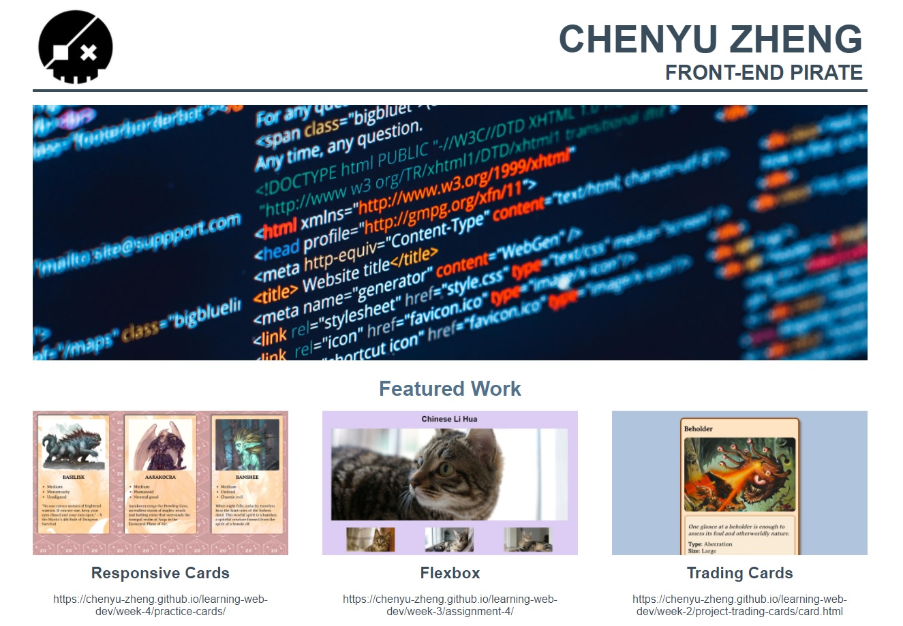

# Portfolio



## Description 
This is a very basic portfolio webpage which has an `hero slider` and a `featured work` list.


## Usage

- **Hero Slider**\
You can add unlimited number of images into the slider by adding `` into:
    ````html
    <div id="hero-container" class="hero">
        <!-- your image -->
        <!-- your image -->
        <!-- ... -->
    </div>
    ```` 

- **Media Query**\
You can alter the breakpoints by modifying the media queries:
    ````css
    @media screen and (min-width: 600px) {
        /* ... */
    }
    ````
### Author

Chenyu zheng
zcy9998@gmail.com