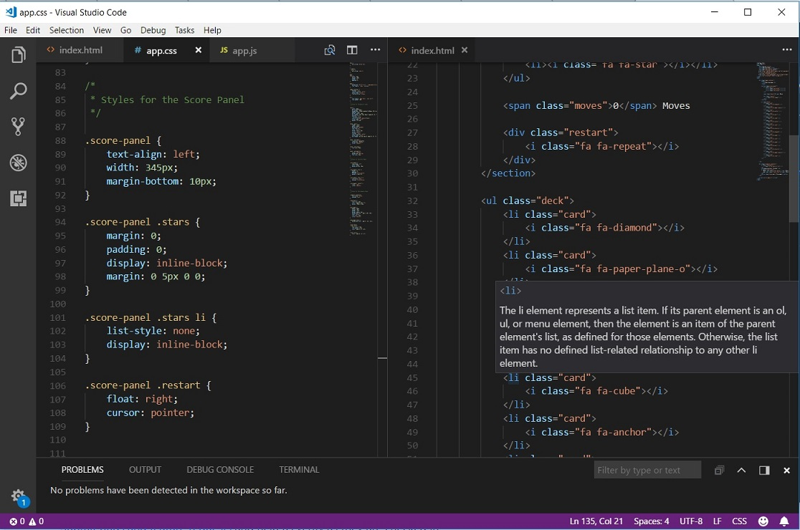

# Visual Studio Code
Visual Studio Code is a source code editor developed by Microsoft for Windows, Mac, and Linux. It is free, customizable, and open-source.

## Installation
1. Download [Visual Studio Code installer](https://go.microsoft.com/fwlink/?LinkID=534107)
2. Run the installer (VSCodeSetup-version.exe).
3. Choose your install path, or VS Code will be installed under `C:\Program Files\Microsoft VS Code` for a 64-bit machine by default.
4. If you are using Windows 7, make sure you have at least [.Net Framework 4.5.2](https://www.microsoft.com/en-us/download/details.aspx?id=42643) installed.

## Usage 
* You can open **Keyboard Shortcuts Editor** by going to the menu **File > Preferences > Keyboard Shortcuts**.
* Find and install extensions at **View > Extensions**.
* Configure the editor by the **View** menu, or go to **File > Preferences > Settings** to edit the `settings.json` file.

## Version
1.21.1